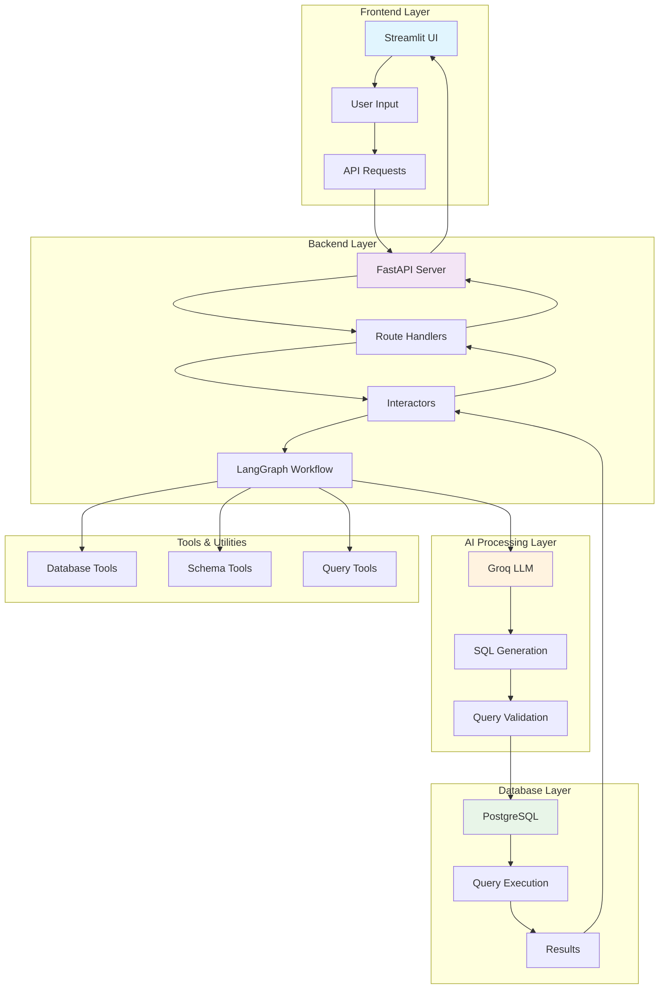
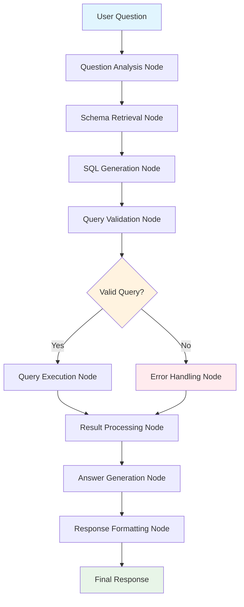

# 🤖 SQL Agent - Natural Language to SQL Query System

A powerful AI-powered application that converts natural language questions into SQL queries and executes them against PostgreSQL databases. Built with FastAPI, Streamlit, LangChain, and Groq AI.

## 🌟 Features

- **🤖 Natural Language Processing**: Convert plain English questions to SQL queries
- **🔄 Multi-Database Support**: Switch between different PostgreSQL databases
- **📊 Auto Schema Discovery**: Automatically fetch and display database schemas
- **🎯 Intelligent Query Generation**: AI-powered SQL query optimization
- **⚡ Real-time Results**: Instant query execution and results display
- **🛡️ Error Handling**: Comprehensive error handling and user feedback
- **🎨 Modern UI**: Clean, responsive Streamlit interface
- **📋 Query History**: Track and manage query history
- **🔧 SQL Formatting**: Beautiful SQL query formatting and syntax highlighting

## 🏗️ Architecture Overview



## 🔄 Application Flow

### 1. User Interaction Flow
```
User Question → Streamlit UI → FastAPI Backend → LangGraph Processing → Database Query → Results Display
```

### 2. Detailed Processing Flow

#### Phase 1: Question Analysis
1. **User Input**: Natural language question entered in Streamlit UI
2. **API Request**: Frontend sends POST request to `/query/ask` endpoint
3. **Route Handler**: FastAPI route receives and validates the request
4. **Interactor**: Business logic layer processes the request

#### Phase 2: AI Processing (LangGraph Workflow)
1. **Question Node**: Analyzes the user's natural language question
2. **Schema Retrieval**: Fetches current database schema for context
3. **SQL Generation**: Groq LLM generates SQL query based on question and schema
4. **Query Validation**: Validates the generated SQL syntax and structure

#### Phase 3: Database Execution
1. **Query Execution**: Executes the SQL query against PostgreSQL database
2. **Result Processing**: Processes and formats the query results
3. **Answer Generation**: AI generates human-readable answer from results

#### Phase 4: Response Delivery
1. **Response Formatting**: Formats the complete response with SQL and answer
2. **API Response**: Returns structured JSON response to frontend
3. **UI Update**: Streamlit displays results in formatted tabs

## 📁 Project Structure

```
sql-agent/
├── backend/                    # FastAPI Backend
│   ├── graph/                 # LangGraph Workflow
│   │   ├── __init__.py
│   │   ├── answer.py          # Answer generation logic
│   │   ├── nodes.py           # LangGraph nodes and workflow
│   │   └── tools.py           # Database tools and utilities
│   ├── interactors/           # Business Logic Layer
│   │   ├── __init__.py
│   │   ├── database.py        # Database operations
│   │   └── query.py           # Query processing
│   ├── routes/                # API Route Handlers
│   │   ├── __init__.py
│   │   ├── database.py        # Database management routes
│   │   ├── health.py          # Health check routes
│   │   └── query.py           # Query processing routes
│   ├── schemas/               # Pydantic Models
│   │   ├── __init__.py
│   │   ├── database.py        # Database-related schemas
│   │   └── query.py           # Query-related schemas
│   ├── __init__.py
│   └── main.py               # FastAPI application entry point
├── frontend/                  # Streamlit Frontend
│   ├── app.py                # Main Streamlit application
│   └── run.py                # Frontend runner script
├── .env                      # Environment variables
├── .gitignore               # Git ignore rules
├── requirements.txt         # Python dependencies
└── README.md               # Project documentation
```

## 🚀 Quick Start

### Prerequisites
- Python 3.8+
- PostgreSQL database
- Groq API key

### Installation

1. **Clone the repository**
```bash
git clone <https://github.com/iqbal-waqar/NLP--SQL-AGENT>
cd sql-agent
```

2. **Install dependencies**
```bash
pip install -r requirements.txt
```

3. **Set up environment variables**
```bash
# Create .env file
GROQ_API_KEY=your_groq_api_key_here
DB_HOST=localhost
DB_PORT=5432
DB_NAME=your_database_name
DB_USER=your_username
DB_PASS=your_password
```

4. **Start the backend server**
```bash
cd backend
python main.py
```

5. **Start the frontend (in a new terminal)**
```bash
cd frontend
python run.py
```

6. **Access the application**
- Frontend: http://localhost:8501
- Backend API: http://localhost:8000
- API Documentation: http://localhost:8000/docs

## 🔧 Configuration

### Environment Variables

| Variable | Description | Default |
|----------|-------------|---------|
| `GROQ_API_KEY` | Groq AI API key for LLM access | Required |
| `DB_HOST` | PostgreSQL host | localhost |
| `DB_PORT` | PostgreSQL port | 5432 |
| `DB_NAME` | Default database name | Required |
| `DB_USER` | Database username | Required |
| `DB_PASS` | Database password | Required |

### Database Configuration

The application supports dynamic database switching. You can:
- Connect to different databases at runtime
- View database schemas
- Switch between multiple PostgreSQL instances

## 🎯 Usage Examples

### Example Questions
- "How many records are in the users table?"
- "Show me the top 5 highest-paid employees"
- "What are the different product categories?"
- "Find all orders placed in the last month"
- "Which customers have made more than 10 orders?"

### API Endpoints

#### Health Check
```http
GET /
```

#### Database Management
```http
GET /database/current          # Get current database info
POST /database/switch          # Switch to different database
GET /database/schema           # Get database schema
```

#### Query Processing
```http
POST /query/ask               # Process natural language question
```

## � LangGraph Agent Architecture

### What is LangGraph?

LangGraph is a library for building stateful, multi-actor applications with LLMs. It extends LangChain's expression language with the ability to coordinate multiple chains (or actors) across multiple steps of computation in a cyclic manner. Our SQL Agent leverages LangGraph to create a sophisticated workflow that can reason about database queries, execute them, and provide intelligent responses.

### Agent Workflow Design



### Agent State Management

The LangGraph agent maintains state throughout the entire workflow:

```python
class AgentState(TypedDict):
    question: str              # Original user question
    schema_info: str          # Database schema context
    sql_query: str            # Generated SQL query
    query_results: List[Dict] # Execution results
    answer: str               # Natural language answer
    error: Optional[str]      # Error information
    metadata: Dict            # Additional context
```

### Node Implementations

#### 1. **Question Analysis Node**
```python
def question_analysis_node(state: AgentState) -> AgentState:
    """
    Analyzes the user's natural language question to understand:
    - Query intent (SELECT, COUNT, AGGREGATE, etc.)
    - Entities mentioned (table names, column names)
    - Relationships and conditions
    - Required data transformations
    """
    question = state["question"]
    # Process and analyze the question
    # Extract key information and context
    return state
```

#### 2. **Schema Retrieval Node**
```python
def schema_retrieval_node(state: AgentState) -> AgentState:
    """
    Fetches relevant database schema information:
    - Table structures and relationships
    - Column names and data types
    - Constraints and indexes
    - Sample data for context
    """
    schema_tool = get_database_schema
    schema_info = schema_tool.invoke({"query": "schema"})
    state["schema_info"] = schema_info
    return state
```

#### 3. **SQL Generation Node**
```python
def sql_generation_node(state: AgentState) -> AgentState:
    """
    Uses Groq LLM to generate SQL query:
    - Combines question context with schema information
    - Generates syntactically correct SQL
    - Optimizes for performance
    - Handles complex joins and aggregations
    """
    llm = ChatGroq(model="llama-3.1-8b-instant", temperature=0)
    
    prompt = ChatPromptTemplate.from_messages([
        ("system", SQL_GENERATION_PROMPT),
        ("human", "Question: {question}\nSchema: {schema_info}")
    ])
    
    chain = prompt | llm
    response = chain.invoke({
        "question": state["question"],
        "schema_info": state["schema_info"]
    })
    
    state["sql_query"] = extract_sql_from_response(response.content)
    return state
```

#### 4. **Query Execution Node**
```python
def query_execution_node(state: AgentState) -> AgentState:
    """
    Executes the generated SQL query:
    - Connects to PostgreSQL database
    - Executes query with proper error handling
    - Formats results for processing
    - Handles timeouts and connection issues
    """
    try:
        db_tool = execute_sql_query
        results = db_tool.invoke({"query": state["sql_query"]})
        state["query_results"] = results
    except Exception as e:
        state["error"] = str(e)
    return state
```

#### 5. **Answer Generation Node**
```python
def answer_generation_node(state: AgentState) -> AgentState:
    """
    Converts SQL results to natural language:
    - Analyzes query results
    - Generates human-readable explanations
    - Provides context and insights
    - Formats response appropriately
    """
    llm = ChatGroq(model="llama-3.1-8b-instant", temperature=0)
    
    prompt = ChatPromptTemplate.from_messages([
        ("system", ANSWER_GENERATION_PROMPT),
        ("human", "Question: {question}\nResults: {results}")
    ])
    
    chain = prompt | llm
    response = chain.invoke({
        "question": state["question"],
        "results": state["query_results"]
    })
    
    state["answer"] = response.content
    return state
```

### Agent Tools Integration

The LangGraph agent uses specialized tools for database operations:

#### Database Schema Tool
```python
@tool
def get_database_schema(query: str) -> str:
    """
    Retrieves comprehensive database schema information
    including tables, columns, relationships, and constraints.
    """
    # Implementation details...
```

#### SQL Execution Tool
```python
@tool
def execute_sql_query(query: str) -> List[Dict]:
    """
    Safely executes SQL queries against the PostgreSQL database
    with proper error handling and result formatting.
    """
    # Implementation details...
```

#### Query Validation Tool
```python
@tool
def validate_sql_query(query: str) -> Dict[str, Any]:
    """
    Validates SQL syntax and structure before execution
    to prevent errors and security issues.
    """
    # Implementation details...
```

### Agent Workflow Execution

The complete workflow is orchestrated using LangGraph's StateGraph:

```python
from langgraph.graph import StateGraph, END

# Create the workflow graph
workflow = StateGraph(AgentState)

# Add nodes
workflow.add_node("question_analysis", question_analysis_node)
workflow.add_node("schema_retrieval", schema_retrieval_node)
workflow.add_node("sql_generation", sql_generation_node)
workflow.add_node("query_execution", query_execution_node)
workflow.add_node("answer_generation", answer_generation_node)

# Define the workflow edges
workflow.add_edge("question_analysis", "schema_retrieval")
workflow.add_edge("schema_retrieval", "sql_generation")
workflow.add_edge("sql_generation", "query_execution")
workflow.add_edge("query_execution", "answer_generation")
workflow.add_edge("answer_generation", END)

# Set entry point
workflow.set_entry_point("question_analysis")

# Compile the workflow
app = workflow.compile()
```

### Error Handling and Recovery

The agent includes sophisticated error handling:

- **SQL Syntax Errors**: Automatically retry with corrected syntax
- **Database Connection Issues**: Graceful fallback and retry mechanisms
- **Query Timeout**: Intelligent query optimization and timeout handling
- **Invalid Results**: Result validation and error reporting

### Agent Benefits

1. **Stateful Processing**: Maintains context throughout the entire workflow
2. **Error Recovery**: Can backtrack and retry with corrections
3. **Modular Design**: Each node can be independently tested and modified
4. **Scalable Architecture**: Easy to add new nodes and capabilities
5. **Debugging Support**: Full visibility into each step of the process

## 🧠 AI Workflow Details

### LangGraph Workflow Components

### AI Model Configuration
- **Model**: Llama-3.1-8b-instant (via Groq)
- **Temperature**: 0.0 (deterministic responses)
- **Max Tokens**: 1000
- **Provider**: Groq AI Platform

## 🎨 Frontend Features

### User Interface Components

1. **Database Management Panel**
   - Current database information
   - Database switching functionality
   - Connection status monitoring

2. **Query Interface**
   - Natural language input area
   - Query execution controls
   - Real-time processing feedback

3. **Results Display**
   - Tabbed interface (Answer/SQL)
   - Formatted SQL syntax highlighting
   - Copy-to-clipboard functionality

4. **Schema Viewer**
   - Database schema exploration
   - Table and column information
   - Relationship visualization

5. **Status Dashboard**
   - API connectivity status
   - System health monitoring
   - Feature overview

## 🛠️ Development

### Backend Development

The backend follows a clean architecture pattern:

- **Routes**: Handle HTTP requests and responses
- **Interactors**: Contain business logic
- **Schemas**: Define data models and validation
- **Graph**: Implement AI workflow logic

### Frontend Development

The frontend uses Streamlit with custom CSS styling:

- **Responsive Design**: Works on desktop and mobile
- **Dark Theme**: Modern dark UI theme
- **Interactive Components**: Real-time updates and feedback
- **Error Handling**: User-friendly error messages

### Adding New Features

1. **Backend**: Add routes → interactors → update schemas
2. **Frontend**: Update UI components → integrate API calls
3. **AI Workflow**: Extend LangGraph nodes → update tools

## 🔍 Troubleshooting

### Common Issues

1. **Groq API Key Error**
   - Ensure GROQ_API_KEY is set in .env file
   - Verify API key is valid and has sufficient credits

2. **Database Connection Issues**
   - Check PostgreSQL server is running
   - Verify database credentials in .env file
   - Ensure database exists and is accessible

3. **Schema Loading Problems**
   - Verify database user has proper permissions
   - Check if database contains tables
   - Ensure PostgreSQL version compatibility

4. **Query Generation Issues**
   - Check if question is clear and specific
   - Verify database schema is available
   - Ensure tables contain relevant data

## 📊 Performance Considerations

- **Query Optimization**: AI generates efficient SQL queries
- **Connection Pooling**: Reuses database connections
- **Caching**: Schema information is cached for performance
- **Error Recovery**: Graceful handling of failures
- **Rate Limiting**: Respects API rate limits

## 🔒 Security Features

- **Input Validation**: All inputs are validated and sanitized
- **SQL Injection Prevention**: Uses parameterized queries
- **Environment Variables**: Sensitive data stored securely
- **Error Handling**: No sensitive information in error messages

## 🤝 Contributing

1. Fork the repository
2. Create a feature branch
3. Make your changes
4. Add tests if applicable
5. Submit a pull request

## 📝 License

This project is licensed under the MIT License - see the LICENSE file for details.

## 🙏 Acknowledgments

- **LangChain**: For the AI workflow framework
- **Groq**: For fast LLM inference
- **Streamlit**: For the beautiful frontend framework
- **FastAPI**: For the high-performance backend
- **PostgreSQL**: For reliable database operations

## 📞 Support

For support and questions:
- Create an issue in the repository
- Check the documentation
- Review the troubleshooting section

---

**Built with ❤️ by Waqar** | Powered by Agent + Groq + PostgreSQL