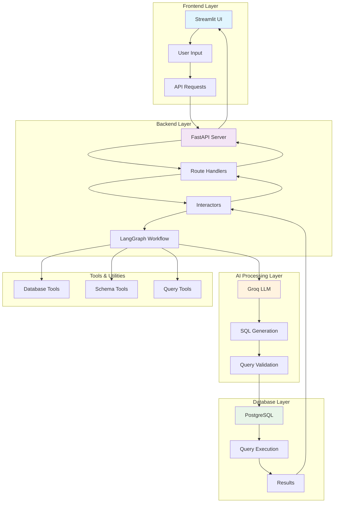
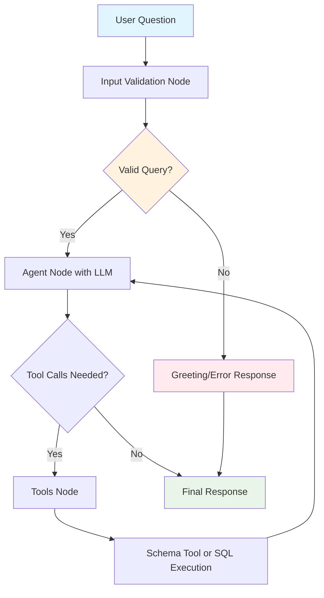

# 🤖 SQL Agent - Natural Language to SQL Query System

A powerful AI-powered application that converts natural language questions into SQL queries and executes them against PostgreSQL databases. Built with FastAPI, Streamlit, LangChain, and Groq AI.

## 🌟 Features

- **🤖 Natural Language Processing**: Convert plain English questions to SQL queries
- **🔄 Multi-Database Support**: Switch between different PostgreSQL databases
- **📊 Auto Schema Discovery**: Automatically fetch and display database schemas
- **🎯 Intelligent Query Generation**: AI-powered SQL query optimization
- **⚡ Real-time Results**: Instant query execution and results display
- **🛡️ Error Handling**: Comprehensive error handling and user feedback
- **🎨 Modern UI**: Clean, responsive Streamlit interface
- **📋 Query History**: Track and manage query history
- **🔧 SQL Formatting**: Beautiful SQL query formatting and syntax highlighting

## 🏗️ Architecture Overview



## 🔄 Application Flow

### 1. User Interaction Flow
```
User Question → Streamlit UI → FastAPI Backend → LangGraph Processing → Database Query → Results Display
```

### 2. Detailed Processing Flow

#### Phase 1: Question Analysis
1. **User Input**: Natural language question entered in Streamlit UI
2. **API Request**: Frontend sends POST request to `/query/ask` endpoint
3. **Route Handler**: FastAPI route receives and validates the request
4. **Interactor**: Business logic layer processes the request

#### Phase 2: AI Processing (LangGraph Workflow)
1. **Input Validation**: Checks for greetings or irrelevant questions
2. **Agent Processing**: Main LLM processes the question with system context
3. **Tool Decision**: Determines if database tools are needed
4. **Schema Retrieval**: Fetches database schema using get_database_schema tool
5. **SQL Generation & Execution**: Generates and executes SQL using execute_sql tool

#### Phase 3: Answer Generation
1. **Result Processing**: Processes raw database query results
2. **Answer Generation**: Separate LLM generates human-readable answer
3. **Response Formatting**: Combines SQL query and natural language answer

#### Phase 4: Response Delivery
1. **API Response**: Returns structured JSON response with SQL and answer
2. **UI Update**: Streamlit displays results in formatted tabs
3. **Query History**: Tracks executed queries for reference

## 📁 Project Structure

```
sql-agent/
├── backend/                    # FastAPI Backend
│   ├── graph/                 # LangGraph Workflow
│   │   ├── __init__.py
│   │   ├── agent.py           # Main LangGraph agent workflow
│   │   ├── answer.py          # Answer generation logic
│   │   ├── nodes.py           # LangGraph nodes and workflow
│   │   └── tools.py           # Database tools and utilities
│   ├── interactors/           # Business Logic Layer
│   │   ├── __init__.py
│   │   ├── database.py        # Database operations
│   │   └── nlp.py             # NLP processing and agent integration
│   ├── routes/                # API Route Handlers
│   │   ├── __init__.py
│   │   ├── database.py        # Database management routes
│   │   └── query.py           # Query processing routes
│   ├── schemas/               # Pydantic Models
│   │   ├── __init__.py
│   │   ├── database.py        # Database-related schemas
│   │   └── query.py           # Query-related schemas
│   ├── utils/                 # Utility Functions
│   │   ├── __init__.py
│   │   └── db_manager.py      # Database configuration management
│   └── __init__.py
├── frontend/                  # Streamlit Frontend
│   ├── app.py                # Main Streamlit application
│   └── run.py                # Frontend runner script
├── main.py                   # FastAPI application entry point
├── .env                      # Environment variables
├── requirements.txt         # Python dependencies
└── README.md               # Project documentation
```

## 🚀 Quick Start

### Prerequisites
- Python 3.8+
- PostgreSQL database
- Groq API key

### Installation

1. **Clone the repository**
```bash
git clone <https://github.com/iqbal-waqar/NLP--SQL-AGENT>
cd sql-agent
```

2. **Install dependencies**
```bash
pip install -r requirements.txt
```

3. **Set up environment variables**
```bash
# Create .env file
GROQ_API_KEY=your_groq_api_key_here
DB_HOST=localhost
DB_PORT=5432
DB_NAME=your_database_name
DB_USER=your_username
DB_PASS=your_password
```

4. **Start the backend server**
```bash
python main.py
```

5. **Start the frontend (in a new terminal)**
```bash
cd frontend
python run.py
```

6. **Access the application**
- Frontend: http://localhost:8501
- Backend API: http://localhost:8000
- API Documentation: http://localhost:8000/docs

## 🔧 Configuration

### Environment Variables

| Variable | Description | Default |
|----------|-------------|---------|
| `GROQ_API_KEY` | Groq AI API key for LLM access | Required |
| `DB_HOST` | PostgreSQL host | localhost |
| `DB_PORT` | PostgreSQL port | 5432 |
| `DB_NAME` | Default database name | Required |
| `DB_USER` | Database username | Required |
| `DB_PASS` | Database password | Required |

### Database Configuration

The application supports dynamic database switching. You can:
- Connect to different databases at runtime
- View database schemas
- Switch between multiple PostgreSQL instances

## 🎯 Usage Examples

### Example Questions
- "How many records are in the users table?"
- "Show me the top 5 highest-paid employees"
- "What are the different product categories?"
- "Find all orders placed in the last month"
- "Which customers have made more than 10 orders?"

### API Endpoints

#### Health Check
```http
GET /
```

#### Database Management
```http
GET /database/current          # Get current database info
POST /database/switch          # Switch to different database
GET /database/schema           # Get database schema
```

#### Query Processing
```http
POST /query/ask               # Process natural language question
```

## 🔄 LangGraph Agent Architecture

### What is LangGraph?

LangGraph is a library for building stateful, multi-actor applications with LLMs. It extends LangChain's expression language with the ability to coordinate multiple chains (or actors) across multiple steps of computation in a cyclic manner. Our SQL Agent leverages LangGraph to create a sophisticated workflow that can reason about database queries, execute them, and provide intelligent responses.

### Agent Workflow Design



### Agent State Management

The LangGraph agent maintains state throughout the entire workflow using a message-based approach:

```python
from typing import TypedDict, Annotated
from langchain_core.messages import HumanMessage, AIMessage
from langgraph.graph.message import add_messages

class AgentState(TypedDict):
    messages: Annotated[list, add_messages]
```

### Node Implementations

#### 1. **Input Validation Node**
```python
def check_greeting_or_irrelevant(state):
    """
    Validates user input and handles greetings or irrelevant questions:
    - Detects greeting patterns (hello, hi, hey, etc.)
    - Identifies irrelevant topics (weather, jokes, etc.)
    - Returns appropriate responses for non-SQL queries
    - Passes valid questions to the main agent
    """
    messages = state["messages"]
    if not messages:
        return state
        
    human_messages = [msg for msg in messages if isinstance(msg, HumanMessage)]
    if not human_messages:
        return state
        
    question = human_messages[-1].content.lower().strip()
    
    greetings = ['hello', 'hi', 'hey', 'good morning', 'good afternoon', 'good evening', 'how are you']
    irrelevant_patterns = ['weather', 'joke', 'story', 'recipe', 'movie', 'music', 'sports', 'news']
    
    if any(greeting in question for greeting in greetings):
        response = AIMessage(content="Hello! I'm a SQL agent specialized in database queries. Please ask me questions about your data and I'll help you write and execute SQL queries.")
        return {"messages": [response]}
    
    if any(pattern in question for pattern in irrelevant_patterns) or len(question) < 3:
        response = AIMessage(content="I'm a SQL agent and can only help with database queries and data analysis. Please ask me questions about your data.")
        return {"messages": [response]}
    
    return state
```

#### 2. **Main Agent Node**
```python
def call_model(state):
    """
    Main LLM processing node that:
    - Processes user questions with system context
    - Decides when to use database tools
    - Generates SQL queries and explanations
    - Handles tool calling workflow
    """
    messages = state["messages"]
    
    # Add system message if not present
    if not any(isinstance(msg, SystemMessage) for msg in messages):
        messages = [system_message] + messages
    
    response = llm_with_tools.invoke(messages)
    return {"messages": [response]}
```

#### 3. **Decision Node**
```python
def should_continue(state):
    """
    Determines workflow continuation:
    - Checks if LLM wants to call tools
    - Routes to tools node or ends workflow
    - Enables iterative tool usage
    """
    messages = state["messages"]
    last_message = messages[-1]
    
    if hasattr(last_message, 'tool_calls') and last_message.tool_calls:
        return "tools"
    return END
```

### Agent Tools Integration

The LangGraph agent uses two specialized tools for database operations:

#### Database Schema Tool
```python
@tool("get_database_schema")
def get_database_schema(query: str = "schema") -> str:
    """
    ALWAYS USE THIS TOOL FIRST! Discovers and returns the complete database schema 
    including tables, columns, and relationships. This is essential to understand 
    the database structure before writing any SQL queries.
    
    Features:
    - Automatic schema discovery from PostgreSQL information_schema
    - Foreign key relationship mapping
    - Column type and constraint information
    - Common query pattern examples
    - Schema caching for performance
    """
    schema = discover_database_schema()
    
    schema_description = "DATABASE SCHEMA:\n\n"
    
    for table_name, table_info in schema["tables"].items():
        schema_description += f"Table: {table_name}\n"
        for col in table_info["columns"]:
            schema_description += f"  - {col['name']} ({col['type']})\n"
        schema_description += "\n"
    
    if schema["relationships"]:
        schema_description += "FOREIGN KEY RELATIONSHIPS:\n"
        for rel in schema["relationships"]:
            schema_description += f"  - {rel['from_table']}.{rel['from_column']} -> {rel['to_table']}.{rel['to_column']}\n"
    
    return schema_description
```

#### SQL Execution Tool
```python
@tool("execute_sql", return_direct=True)
def execute_sql(sql_query: str) -> str:
    """
    Executes a SQL query on the connected database and returns results.
    
    Features:
    - Direct PostgreSQL connection using psycopg2
    - Automatic query cleaning (removes markdown formatting)
    - Comprehensive error handling
    - Result formatting for LLM processing
    - Query tracking for answer generation
    """
    global _last_sql_query
    
    cleaned_query = sql_query.strip()
    if cleaned_query.startswith('`') and cleaned_query.endswith('`'):
        cleaned_query = cleaned_query[1:-1].strip()
    
    _last_sql_query = cleaned_query
    
    conn = get_database_connection()
    cursor = conn.cursor()
    
    try:
        cursor.execute(cleaned_query)
        result = cursor.fetchall()
    except Exception as e:
        result = f"Error executing query: {str(e)}"
    finally:
        cursor.close()
        conn.close()
    
    return str(result)
```

### Agent Workflow Execution

The complete workflow is orchestrated using LangGraph's StateGraph:

```python
from langgraph.graph import StateGraph, END
from langgraph.prebuilt import ToolNode

def get_agent():
    workflow = StateGraph(AgentState)
    
    # Add nodes
    workflow.add_node("check_input", check_greeting_or_irrelevant)
    workflow.add_node("agent", call_model)
    workflow.add_node("tools", ToolNode(tools))
    
    # Set entry point
    workflow.set_entry_point("check_input")
    
    # Define workflow edges
    workflow.add_edge("check_input", "agent")
    workflow.add_conditional_edges(
        "agent",
        should_continue,
        {
            "tools": "tools",
            END: END,
        }
    )
    workflow.add_edge("tools", "agent")
    
    # Compile the workflow
    app = workflow.compile()
    return app
```

### System Prompt and AI Configuration

The agent uses a comprehensive system prompt that guides the LLM behavior:

```python
system_message = SystemMessage(content="""You are a SQL expert assistant. When answering questions about data:

WORKFLOW:
1. ALWAYS start by using the get_database_schema tool to understand the database structure
2. Pay careful attention to which table contains which columns and their relationships
3. Use proper JOINs when data spans multiple tables based on foreign key relationships
4. Use the exact table and column names shown in the schema
5. Generate efficient SQL queries based on the discovered schema
6. ALWAYS execute the SQL query using execute_sql tool and provide the actual results

CRITICAL QUERY REQUIREMENTS:
- When asked about "customers", always include customer names (first_name, last_name) by joining with the customers table
- When asked about "products", always include product names by joining with the products table  
- When asked about "orders", include relevant details like order_date, total_amount
- Always provide meaningful, human-readable results, not just IDs
- When using GROUP BY with JOINs, include all non-aggregate columns in the GROUP BY clause

WORKFLOW RULES:
- Call get_database_schema ONLY ONCE at the beginning to understand the structure
- After getting the schema, immediately proceed to execute_sql with your query
- Do NOT call get_database_schema multiple times for the same question
- Be consistent in your approach for similar questions""")
```

### Answer Generation Process

After the LangGraph agent processes the query, a separate answer generation step creates human-readable responses:

```python
def generate_answer(user_question, sql_query, db_result):
    """
    Converts raw database results into natural language answers:
    - Uses Groq LLM (llama3-8b-8192) for answer generation
    - Provides direct, concise responses
    - Formats results appropriately for user consumption
    """
    prompt = ChatPromptTemplate.from_template("""
        User asked: {user_question}
        SQL Query: {sql_query}
        Database result: {db_result}

        Provide ONLY a direct, natural language answer. Do not include explanations, reasoning, or extra text.

        Examples:
        - If result = [(20,)] → "There are 20 students."
        - If result = [('John',), ('Jane',)] → "The students are John and Jane."
        - If result = [(100, 'CS'), (50, 'Math')] → "There are 100 students in CS and 50 students in Math."
        
        Answer:
    """)

    llm = ChatGroq(
        groq_api_key=os.getenv("GROQ_API_KEY"),
        model_name="llama3-8b-8192"
    )

    chain = prompt | llm | StrOutputParser()
    return chain.invoke({
        "user_question": user_question,
        "sql_query": sql_query,
        "db_result": db_result
    })
```

### Agent Benefits

1. **Message-Based State**: Uses LangChain's message system for natural conversation flow
2. **Tool Integration**: Seamless integration with database tools using LangGraph's ToolNode
3. **Input Validation**: Handles greetings and irrelevant queries appropriately
4. **Iterative Processing**: Can call multiple tools in sequence as needed
5. **Error Handling**: Comprehensive error handling at both tool and workflow levels
6. **Performance Optimization**: Schema caching and efficient query execution

## 🧠 AI Workflow Details

### LangGraph Workflow Components

### AI Model Configuration

#### Main Agent Model
- **Model**: llama-3.1-8b-instant (via Groq)
- **Temperature**: 0.0 (deterministic responses)
- **Max Tokens**: 1000
- **Provider**: Groq AI Platform
- **Usage**: SQL generation and query processing

#### Answer Generation Model
- **Model**: llama3-8b-8192 (via Groq)
- **Temperature**: Default
- **Provider**: Groq AI Platform
- **Usage**: Converting SQL results to natural language answers

## 🎨 Frontend Features

### User Interface Components

1. **Database Management Panel**
   - Current database information
   - Database switching functionality
   - Connection status monitoring

2. **Query Interface**
   - Natural language input area
   - Query execution controls
   - Real-time processing feedback

3. **Results Display**
   - Tabbed interface (Answer/SQL)
   - Formatted SQL syntax highlighting
   - Copy-to-clipboard functionality

4. **Schema Viewer**
   - Database schema exploration
   - Table and column information
   - Relationship visualization

5. **Status Dashboard**
   - API connectivity status
   - System health monitoring
   - Feature overview

## 🛠️ Development

### Backend Development

The backend follows a clean architecture pattern:

- **Routes**: Handle HTTP requests and responses
- **Interactors**: Contain business logic
- **Schemas**: Define data models and validation
- **Graph**: Implement AI workflow logic

### Frontend Development

The frontend uses Streamlit with custom CSS styling:

- **Responsive Design**: Works on desktop and mobile
- **Dark Theme**: Modern dark UI theme
- **Interactive Components**: Real-time updates and feedback
- **Error Handling**: User-friendly error messages

### Adding New Features

1. **Backend**: Add routes → interactors → update schemas
2. **Frontend**: Update UI components → integrate API calls
3. **AI Workflow**: Extend LangGraph nodes → update tools

## 🔍 Troubleshooting

### Common Issues

1. **Groq API Key Error**
   - Ensure GROQ_API_KEY is set in .env file
   - Verify API key is valid and has sufficient credits

2. **Database Connection Issues**
   - Check PostgreSQL server is running
   - Verify database credentials in .env file
   - Ensure database exists and is accessible

3. **Schema Loading Problems**
   - Verify database user has proper permissions
   - Check if database contains tables
   - Ensure PostgreSQL version compatibility

4. **Query Generation Issues**
   - Check if question is clear and specific
   - Verify database schema is available
   - Ensure tables contain relevant data

## 📊 Performance Considerations

- **Query Optimization**: AI generates efficient SQL queries
- **Connection Pooling**: Reuses database connections
- **Caching**: Schema information is cached for performance
- **Error Recovery**: Graceful handling of failures
- **Rate Limiting**: Respects API rate limits

## 🔒 Security Features

- **Input Validation**: All inputs are validated and sanitized
- **SQL Injection Prevention**: Uses parameterized queries
- **Environment Variables**: Sensitive data stored securely
- **Error Handling**: No sensitive information in error messages

## 🤝 Contributing

1. Fork the repository
2. Create a feature branch
3. Make your changes
4. Add tests if applicable
5. Submit a pull request

## 📝 License

This project is licensed under the MIT License - see the LICENSE file for details.

## 🙏 Acknowledgments

- **LangChain**: For the AI workflow framework
- **Groq**: For fast LLM inference
- **Streamlit**: For the beautiful frontend framework
- **FastAPI**: For the high-performance backend
- **PostgreSQL**: For reliable database operations

## 📞 Support

For support and questions:
- Create an issue in the repository
- Check the documentation
- Review the troubleshooting section

---

**Built with ❤️ by Waqar** | Powered by Agent + Groq + PostgreSQL
